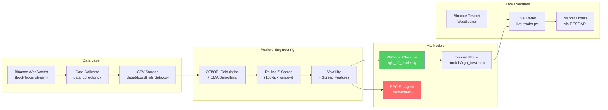
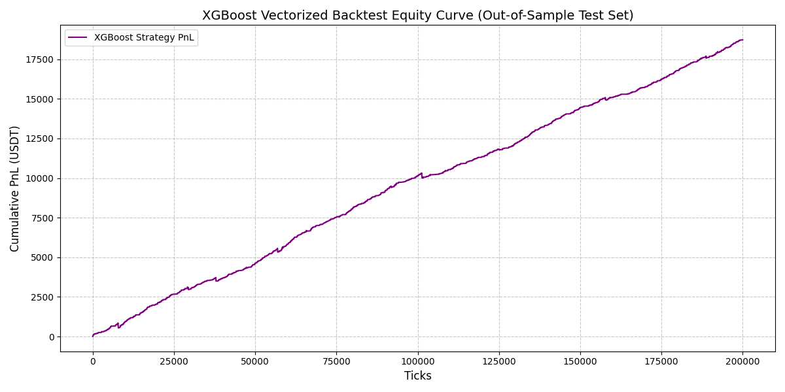

# HFT Order Flow Imbalance (OFI) Trading Bot

[](https://www.python.org/downloads/)
[](LICENSE)
[](https://xgboost.readthedocs.io/)

A **high-frequency trading (HFT)** research project for Binance Futures that uses real-time Level-1 order book streaming and machine learning to predict short-term directional price movements based on **Order Flow Imbalance (OFI)**, **Order Book Imbalance (OBI)**, and rolling **Z-Scores**.

> **Status: Retired** — See [POST_MORTEM.md](POST_MORTEM.md) for a detailed analysis of why the strategy was mathematically unviable due to exchange commission structure.

---

## Architecture



---

## Research Evolution

This project went through **10 architectural iterations** — a journey from Reinforcement Learning to Supervised Learning:

| Phase | Approach | Result |
|-------|----------|--------|
| V1–V7 | PPO Reinforcement Learning | ❌ Death spiral from overtrading penalties and adverse selection |
| V8–V9 | XGBoost (Hist Gradient Boosting) | ✅ 86–90% directional recall on 200K+ tick events |
| V10 | Live Testnet Integration | ⚠️ Retired: 0.04% taker commission > captured alpha |

### Key Results (XGBoost V9 — Out-of-Sample)

| Metric | Value |
|--------|-------|
| Directional Recall | 86–90% |
| Evaluation Window | 200,000+ continuous tick events |
| Inference Latency | < 1 ms per 150-tick sliding window |
| Prediction Target | 1.0 USDT price breakout within 10 ticks |



---

## Technical Features

- **Asynchronous Live Pipeline**: `asyncio` + `websockets` for ultra-low latency `bookTicker` ingestion
- **Micro-Market Feature Engineering**: Vectorized 20-tick EMA, 100-tick rolling Z-scores to filter noise and expose raw liquidity shifts
- **Server Time Drift Correction**: Automatically syncs local clock against Binance `serverTime` to prevent `-1021` timestamp errors
- **Built-in PnL Tracking**: Internal position management with double-order flipping (Short→Long) and 0.04% commission deduction
- **Aggression Cooldowns**: 50-tick post-execution cooldown to prevent rate-limit violations during volatility spikes
- **Optuna Hyperparameter Tuning**: Automated PPO hyperparameter search with train/validation/test split

---

## Installation

### Prerequisites
- Python 3.10+
- pip

### Setup

```bash
# Clone the repository
git clone https://github.com/RaufEksi/arbitrage_bot.git
cd arbitrage_bot

# Create and activate virtual environment
python -m venv venv
source venv/bin/activate        # Linux / macOS
# venv\Scripts\activate         # Windows

# Install dependencies
pip install -r requirements.txt
```

### Configuration

Copy the example environment file and fill in your Binance Testnet API keys:

```bash
cp .env.example .env
```

Get your testnet keys at: https://testnet.binancefuture.com/

---

## Usage

### 1. Collect Live Data
```bash
python data_collector.py --ticks 50000
```

Or download historical data in bulk:
```bash
python download_historical.py --trades 500000
```

### 2. Train XGBoost Model
```bash
python xgb_hft_model.py
```
This performs a chronological 80/20 split (no shuffling to prevent temporal leakage), trains the classifier, prints a classification report, saves the model to `models/xgb_best.json`, and generates an equity curve.

### 3. Live Testnet Trading
```bash
python live_trader.py
```
The bot connects to Binance Futures Testnet, processes real-time bookTicker data, and executes market orders when Z-score breakouts are detected. Runs in simulation mode if no API keys are configured.

### 4. Run Tests
```bash
python -m pytest test_env.py -v
```

---

## Project Structure

```
├── config.py               # Central configuration (paths, API, hyperparameters)
├── logger.py                # Structured logging setup
├── data_collector.py        # Live WebSocket data collection
├── download_historical.py   # Bulk historical data download (REST API)
├── orderbook.py             # L2 order book state management
├── ofi_calculator.py        # Order Flow Imbalance (Cont et al. 2014)
├── websocket_manager.py     # WebSocket connection with auto-reconnect
├── env.py                   # Gymnasium RL environment (V7, numpy-optimized)
├── xgb_hft_model.py         # XGBoost training and backtesting
├── live_trader.py            # Async live trading engine
├── train_agent.py           # PPO training pipeline (deprecated)
├── optimize_agent.py        # Optuna hyperparameter optimization
├── backtest.py              # PPO backtest with equity curve
├── colab_train.py           # Google Colab training script
├── colab_optimize.py        # Google Colab Optuna script
├── test_env.py              # Environment unit tests (pytest)
├── main.py                  # Entry point for L2 depth stream
├── POST_MORTEM.md           # Project retirement analysis
└── data/                    # Market data (gitignored)
```

---

## Lessons Learned

1. **L1 data is insufficient for HFT**: `bookTicker` (Top of Book) alone cannot support profitable market making. L2/L3 depth data with queue position estimation is required.

2. **RL struggles with noisy HFT environments**: PPO penalty mechanisms distort the agent's rational decision-making, creating death spirals rather than preventing overtrading.

3. **Predictive alpha ≠ profitable alpha**: Even with 86–90% directional recall, the structural cost of taker commissions (0.04% × 2 per round trip) exceeded the captured edge on microscopic price movements.

4. **Knowing when to stop is a skill**: Transparently retiring an unprofitable strategy — rather than overfitting to past data — is a core principle of quantitative research.

---

## Disclaimer

This software is provided for **educational and research purposes only**. High-frequency trading carries severe financial risk, especially in cryptocurrency derivatives. It is strictly recommended to run this within the Binance Testnet environment. The authors are not responsible for any financial losses.

---

## License

This project is licensed under the MIT License — see [LICENSE](LICENSE) for details.
